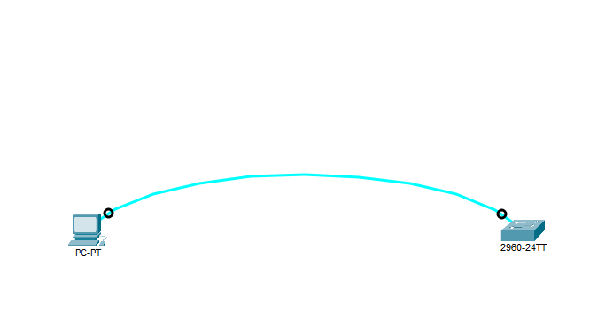

# 🔐 Port security — Tutorial
- When you buy a Cisco device like a switch or router, 
it comes with a basic configuration and no security enabled by default. 
- You are responsible for securing it. 
- How? Stay with me and we will figure it out together.
## 📖 Part 1 — Console Password (Type 7):
### 📝 Summary:
Set a basic console line password to secure device access (weak, Type 7 encryption).
### 🎯 Objective
- Understand the need for securing console access on Cisco devices.  
- Configure a basic console line password using `line console 0`.  
- Verify console login with the configured password.  
- Be aware of Type 7 password weakness.  

### 🧩 Topology
 
<p align="center">
  
</p>

- One PC and one Switch 
- One PC connected to one Switch via a console cable (RS-232 → Console)

### 🛠️ Step-by-Step
Use the following commands to configure a console password :
  ```cisco
  Switch> enable
  Switch# configure terminal
  Switch(config)# line console 0
  Switch(config-line)# password 123
  Switch(config-line)# login
  Switch(config-line)# end
```
<p align="center">

| Command              | Description                         |
|----------------------|-------------------------------------|
| line console 0       | Enter console line configuration    |
| password 123         | Set console password (123)          |
| login                | Enable password checking on console |
| end / Ctrl+Z         | Exit to privileged EXEC mode        |

</p>

### 🔑 Extra: Securing with `service password-encryption`

Another method is to use the command `service password-encryption`.  
This command hides all plain-text passwords in the running configuration by converting them into Type 7.  

If you add the command service password-encryption in global configuration: 
```cisco
Switch(config)# service password-encryption
```
Then in show running-config the password will appear encrypted (Type 7):
```cisco
line console 0
  password 7 0822455D0A16
  login
```

And if you don't add :
```cisco
line console 0
  password 123
  login
```

### 🔑 Extra: Removing Encryption

If you want to remove the encryption applied by `service password-encryption`,  
use the command:

```cisco
Switch(config)# no service password-encryption
```
Now, when you check the running configuration again:
- The command **does not actually decrypt stored values**;
it simply stops encrypting **new or updated passwords**.
- Already encrypted ones may remain until reconfigured
### ✅ Verification:
- Exit the console session (close terminal).
- Reconnect to the switch via console.
- You should now be prompted for a password before accessing User EXEC mode.

### ⚠️ Note:
This method is weak because:
> - Type 7 encryption is easily reversible.  
> - Only one shared password for all users.  
> - No usernames, so no individual accountability.  
> - Works only on console line (no centralized authentication).  

So what should we do? 🤔  
- In the next part you will get the answer.  
- For now, just practice this method to understand the basics.


---
---
---
## 📖 Part 2 — Local Authentication:


### 📝 Summary:
Using only passwords can lead to many problems. For example, if we have three users who need to log in to a Cisco device with different access levels, we must create **three separate users**. This can be accomplished using **local authentication**.

### 🎯 Objectives:


### 🧩 Topology:


### 🛠️ Step-by-Step:
```cisco

```
### ✅ Verification:


### ⚠️ Note:
